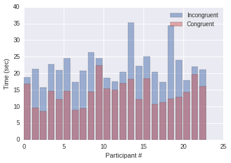

# Test a Perceptual Phenomenon
by Jeffrey Lewis
##Section 1. Identify variables in the experiment
What is our independent variable? What is our dependent variable?
```
Independent Variable: Congruent and incongruent test
Dependent Variable: Time it takes for the participant to complete the test.
```

##Section 2: Establish a hypothesis and statistical test
What is an appropriate set of hypotheses for this task?

```
Null hypothesis (H0)
Alternative Hypothesis (H1)
Population mean of Congruent Test (μC)
Population mean of Incongruent Test (μI)


H0: μC=μI
The average time it takes to complete the congruent test is equal to the average time it takes to complete the incongruent test.

H1: μC≠μI
The average time difference is significantly different when taking the congruent test and incongruent test.
```

What kind of statistical test do you expect to perform? Justify your choices.

```
Type of test: Two-tailed dependent t-test. I chose this because the sample size was below 30 and because the population's standard deviation is unknown. I also used it because I wanted to know the difference between the two paired samples.
```

##Section 3: Report descriptive statistics
Report some descriptive statistics regarding this dataset. Include at least one measure of central tendency and at least one measure of variability.
```
Congruent mean: 14.0
Incongruent mean: 22.0
Congruent SD: 3.6
Incongruent SD: 4.8
Mean difference: 7.9
```

##Section 4: Plot the data
Provide one or two visualizations that show the distribution of the sample data. Write one or two sentences noting what you observe about the plot or plots.



Each participant's congruent time vs their incongruent time.

##Section 5: Perform the statistical test and interpret your results
What is your confidence level and your critical statistic value? 

``` 
Confidence level on the mean difference; 95%; CI =(-18.03, 2.10)
Critical statitic value = (-2.069, 2.069)
d = -1.64
r^2 = .74
```
Do you reject the null hypothesis or fail to reject it?
```
t(23)=-8.02, p < .05, two-tailed
```
Did the results match up with your expectations?
```
Because my p value fell into my critical region of 0.05 the null hypothesis is rejected.
In this test it seems that the brain processes the words faster than it processes colors. When the color does not match the word, there seems to be an interference. The results match my expectations.
```
## References and Dataset
```
[View CSV](stroopdata.csv)
https://faculty.washington.edu/chudler/words.html
https://en.wikipedia.org/wiki/Stroop_effect
https://www.rit.edu/cla/gssp400/sbackground.html
```